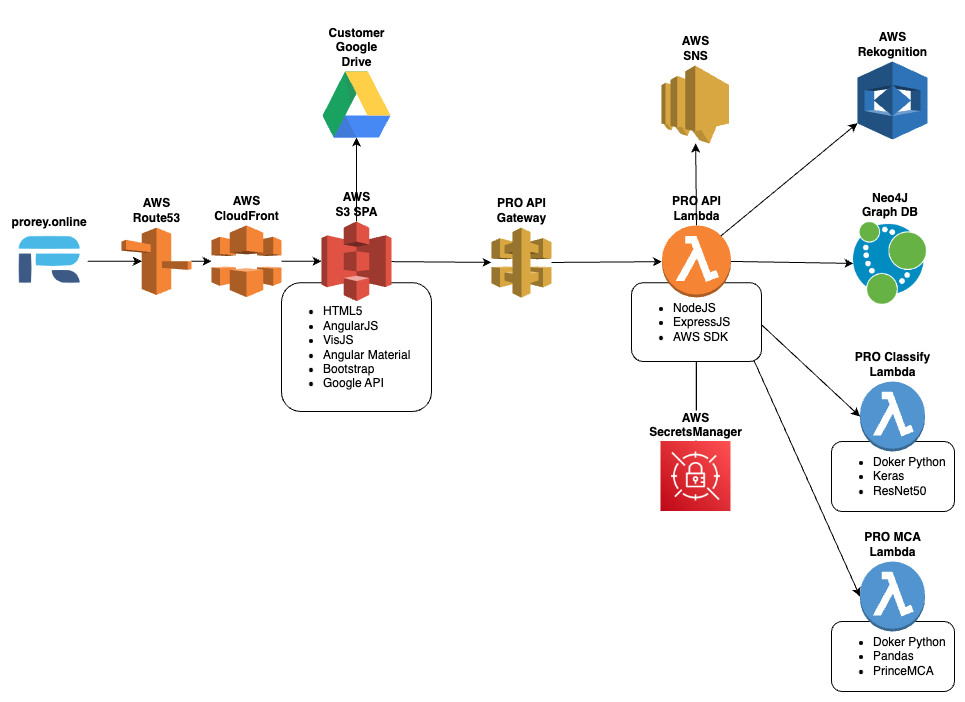
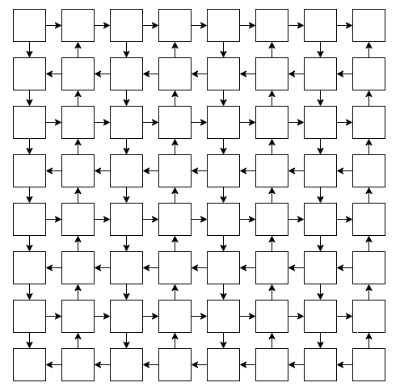
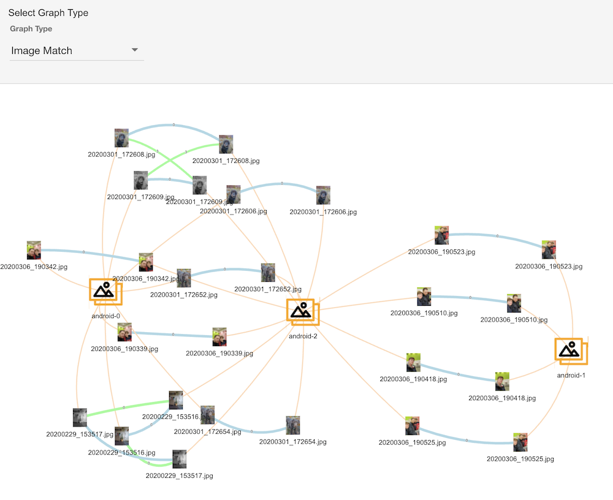
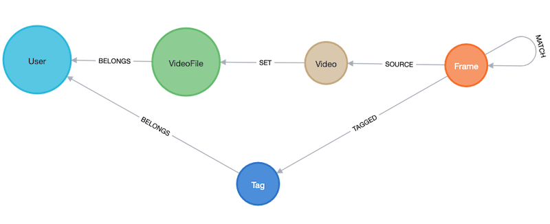
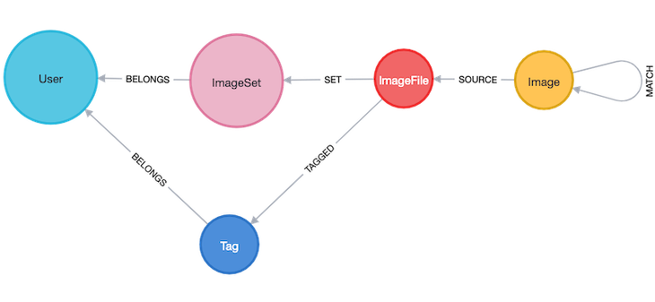
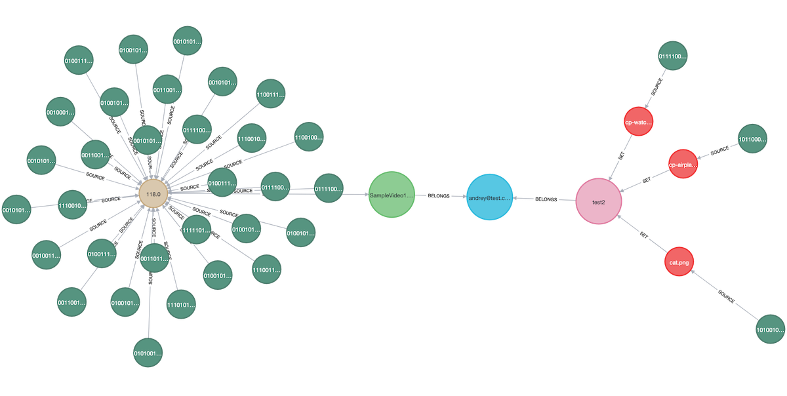
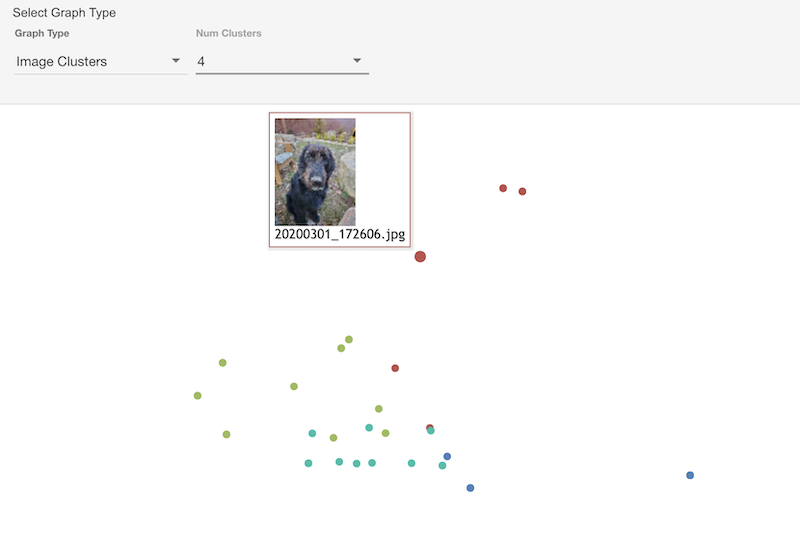
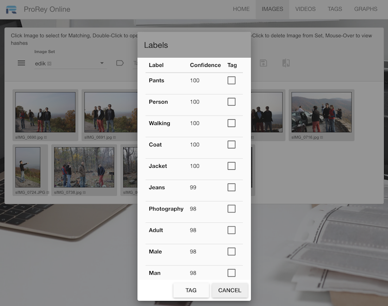

# ProRey Online


[](LICENSE)  
by [ProRey Tech](https://prorey.com)  
Live: [prorey.online](https://prorey.online)

ProRey Online is a single-page application for tagging and comparing images and videos locally. It uses perceptual hashing (dHash) to identify similarities and stores data in a scalable graph database. Built using the **NAVEN** stack (Neo4J, AngularJS, VisJS, ExpressJS, NodeJS), it supports cloud-based comparisons without uploading media files.


---

## Table of Contents
1. [Features](#features)
2. [Tech Stack](#tech-stack)
3. [UI & User Experience](#ui--user-experience)
4. [Client-Side Processing](#client-side-processing)
5. [Backend & Graph Database](#backend--graph-database)
6. [Machine Learning & Labeling](#machine-learning--labeling)
7. [Build & Deployment](#build--deployment)
8. [Security](#security)
9. [License](#license)

---

## Features
- Tag images and video frames from local files, networks, or Google Drive.
- Perform local dHash generation and comparison.
- Store dHashes in a Neo4J graph database for scalable querying.
- Visualize relationships using VisJS graph interface.
- AI-powered image/frame labeling and clustering.
- Single-page design with fast, responsive UI.

---

## NAVEN Tech Stack
| Component    | Description                                   |
|--------------|-----------------------------------------------|
| **Neo4J**    | Graph database used for storing dHash links   |
| **AngularJS**| Frontend SPA framework                        |
| **VisJS**    | Graph visualization in-browser                |
| **ExpressJS**| Backend REST API via AWS Lambda               |
| **NodeJS**   | Runtime for serverless backend logic          |



---

## UI & User Experience

- **Landing Page**: Bootstrap static site hosted on AWS S3 + CloudFront.  
- **Main App**: AngularJS SPA hosted separately on AWS S3 + CloudFront.
- **Routing**: Handled with Angular's `routeProvider`.

### AngularJS Routing Example
```js
$routeProvider
    .when('/images', {
        templateUrl: 'images.html',
        controller: 'imageController'
    })
```

### Material UI
Uses [AngularJS Material](https://material.angularjs.org/latest) for UI elements like dialogs, menus, tables.

---

## Client-Side Processing
### Image & Video Loading
Off-screen canvases are used to load and analyze media:
```js
function getImageData(img, width, height) {
    const canvas = document.createElement('canvas');
    canvas.width = width;
    canvas.height = height;
    const ctx = canvas.getContext('2d');
    ctx.drawImage(img, 0, 0, width, height);
    return ctx.getImageData(0, 0, width, height);
}
```

### dHash & Hamming Comparison

```js
function hamming(x, y) {
    return (x ^ y).toString(2).split('1').length - 1;
}
```

**Hamming Distance Example**  
```
dHash1 = (1,0,1,0,0,0,1,1,1,0,1)
dHash2 = (0,0,1,1,0,1,1,1,0,0,0)
hamming = 1+0+0+1+0+1+0+0+1+0+1 = 5
```



### Local & Cloud File Access
- Local files: ⧈ marked, stored with IndexedDB
- Google Drive files: ⟁ marked, accessed via Google APIs

---

## Backend & Graph Database
### Serverless Backend
- Hosted on AWS Lambda using `aws-serverless-express`
- APIs exposed via AWS API Gateway (with CORS)

### Neo4J Graph Design
  
  


- Nodes: `Users`, `Images`, `Frames`, `Videos`  
- Relationships: `BELONGS`, `MATCH`, `SOURCE`, `SET`  
- All business logic via Neo4J Cypher queries

```js
const CREATE_MATCHES_FRAME = `
    MATCH (frm:Frame{pos:$pos})-[:SOURCE]-(vidFrm:Video{md5:$md5})
    ...
    MERGE (frm)-[:MATCH{dist:dist}]-(src)`;
```

### Transaction Handling
- Batch CQL execution via Neo4J transactions
- Supports concurrent match creation and rollback on error

---

## Machine Learning & Labeling
### Clustering


- dHash 2D projection using [Prince MCA](https://github.com/MaxHalford/prince)  
- Clustered using KModes based on Hamming distances

### Image Labeling


- Uses AWS Rekognition SDK and ResNet152V2 in Dockerized Lambda
- Top-10 labels returned per image/frame

```js
new AWS.Rekognition().detectLabels(...)
```

---

## Build & Deployment
### Tools Used
- BitBucket for private repo hosting
- AWS CloudFormation + AWS CLI for backend deployment
- Gulp for JavaScript minification/annotation

```bash
aws cloudformation deploy
aws s3 sync public
```

```js
gulp.task('prod', () => {
    gulp.src(...).pipe(ngAnnotate()).pipe(uglify()).pipe(gulp.dest('.'));
});
```

---

## Security
- JWT-based authentication using `node-jsonwebtoken`
- AWS Secrets Manager stores credentials (Neo4J, JWT)

```js
secretsManager.getSecretValue({ SecretId: 'proreySecret' }, ...);
```

---

## License
This project is licensed under the [MIT License](LICENSE).
